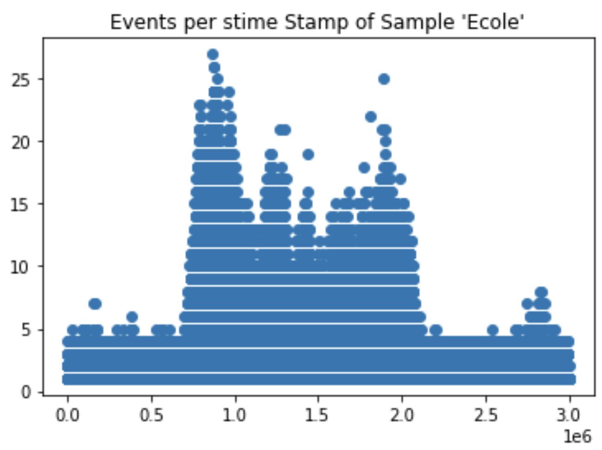
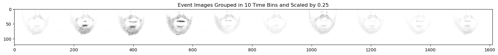

# Lip Reading Classification Using Event Camera Data

## Introduction
This project aims to classify three-second video recordings of spoken words into one of ten classes by teaching a model to read lips. The unique aspect of this challenge is that the samples we captured usiong an event camera, which records asynchronous pixel-based events. An event camera provides high detail by recording with an extemely high temporal resolutuon. In each of our samples there are approximately 6M time steps represented over the 3-second interval. in campriosn, a traditional video camera capturing frames at 24fps, woudl only provide 24*3 = 72 timesteps of data. 

## Dataset
The dataset consists of 420 recordings, with 320 labeled for training and 100 for model evaluation. Each sample is represented by a four-column dataframe, with each row depicting an event defined by 'x', 'y', 'polarity', and 'time' attributes. The attributes 'x' and 'y' specificy the percise pixel that triggered the event, while 'time' specifies the timestamp of the event. The attribute 'polarity' is either -1 or +1, and tells us if the pixel has observed a positive of negative increase in log lumnicnace since the last time an event was triggered at the pixel.

*A historgram showing the number of events per timestamp*

*A historgram showing the number of events per timestamp*

## Data Processing
We converted event camera data stream into 'videos' by mapping each sample to n image frames, achieved by binning the 'time' attribute and summing the events fired at a specific pixel. For this sumamtion we focus exclusivly on positive events. We also scaled images to reduce model input layer dimensions, thus decreasing parameters, complexity, and training time.

## Model Architecture
Our model combines convolutional layers for feature extraction from image frames and a recurrent neural network to capture temporal relationships. I used ConvLSTM2D layers, which apply convolutional filters to LSTM inputs, handling both spatial and temporal data effectively.

## Training
The training involved an 80/20 train/test split, with models trained for up to 50 epochs, using early stopping based on validation accuracy. We explored hyperparameters related to pixel and time resolution and dropout levels to optimize accuracy.

## Model Selection and Performance
The final model, constrained by memory limitations, used a rescaling factor of 0.60x and a frame length of n=8, achieving 83% accuracy. This model overcame the challenges of high data dimensionality and memory issues common in event-camera data processing.

## Conclusion
This approach highlights the potential of using event cameras for detailed action capture, though memory limitations were a significant challenge. Future improvements could include incorporating negative polarity events and exploring transformer architectures for better results. While this approach was able to acheive high accuracy, the fact that samples were binned along the time dimension introduces latency to the model. This latency means that we're not taking full advantage of the time resolution of the event camera sensor, which could be down if the event stream is consumed directly by the mdoel. 

## Graphs and Analysis
Graphs illustrating the impact of different parameters on model accuracy are detailed in the report. They show how pixel and time resolution, as well as dropout levels, influence model performance.
